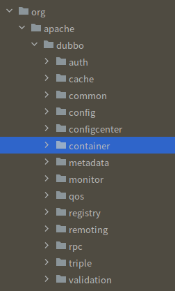

# Dubbo API 暴露与访问控制

## 1.0 项目介绍

所谓面向对象，在我看来就是我们为了化抽象为具象从而增添软件的可维护性，采取了这样的手段，将抽象的程序世界中的一些功能和数据的集合投影在现实世界。以类为一个基本容器，来封装数据和功能单元，容器不同，数据不同进而产生不同的对象，对象之间通过暴露的接口交流，进而维持了程序的运行，这时候每个对象对于内部实现的隐藏以及外部接口暴露的控制就显得十分重要。

java提供了四种访问修饰符，让我们对容器中的数据功能单元的可见性进行访问控制。

| 访问修饰符 | 类内 | 包内 | 子类内 | 无限制 |
| ---------- | ---- | ---- | ------ | ------ |
| public     | 可见 | 可见 | 可见   | 是     |
| protect    | 可见 | 可见 | 可见   |        |
| default    | 可见 | 可见 |        |        |
| private    | 可见 |      |        |        |

如果以一个类为基本容器，那么public和private权限就已经完全够用了。但是为了扩大控制范围在此基础上我们又增加了protect和default修饰符，让我们可以最大以包为边界进行访问控制。

但是以包为权限的访问控制能够满足面向对象的全部需要吗？

是不能的，因为包的概念还不够大，我们在现实世界中为一组数据和功能的集合找到类作为封装依据的边界，虽然可以以一个包作为一些类的集合，来提供一组服务，依据包我们也可以根据现有修饰符确定一个边界，但是包的概念还是太小了，我们不可能将一个模块的所有类放在同一个包下这是一个现实问题毕竟dubbo的包结构是这样，其中每个包点开还有无数复杂结构。




在java中jar包是最接近一个模块的概念的，一个模块可以看作一个服务的基本单位或者一组服务的集合，比如引入dubbo.jar，我们就可以使用rpc服务，引入fastjson.jar我们可以使用序列化服务

那么既然确定了暴露边界---jar包，这时我们就需要考虑以jar包为单位对dubbo进行访问控制。

现在给出了两种方案，利用java9带来的模块化特性，和jar嵌套迷惑类加载器。


## 2. Java9 Module方案


```java
|- Dubbo
    |-org
    	|-apache
    		|-dubbo
    			|-config
    				|-A.java
                       |.......
    			|-common
                        |B.java
                        |.....
```

这是一个java9之前一个jar包的目录结构，与此不同的是java9 jar包的根目录下多了一个模块描述化描述符module-info.java

```java
|- Dubbo
    |-org
    	|-apache
    		|-dubbo
    			|-config
    				|-A.java
                       |.......
    			|-common
                        |B.java
                        |.....
    |-module-info.java
```

在这个描述符中我们可以声明对其他包的依赖，还可以选择要导出哪些包。类似于这样

```java
module dubbo {
    exports org.apache.dubbo.config
}
```

这样我们就导出了config包，可以看到的是我们并没有导出common包。那么对于common包中public的类，其他包就无法访问到。

那么按理来说，我们只需要遵循这种规则做一个模块化描述符就行了，但事情往往不是那么简单的。

我们最初是想要做到像jdk9的那种效果，就是严格按照模块化来做，jdk9确实也达到了封装的效果，就是我们去访问一个未导出的包时会编译报错。

但后来发现，我们的包做了模块化后，外边还是能够访问到，并没有达到预想的效果。。。。。

后来查阅大量资料，我发现原来是这样的。

 为了保证原来的


## 3. jar嵌套迷惑类加载器

### 3.1 理论依据

// todo 介绍类加载机制

我们利用AppClassLoader不能加载标准目录格式的jar包的特点来向AppClassLoader隐藏我们的类，就是我们可以将我们的jar包做成这样

|-dubbo.jar

​		|dubboInternal.jar

这样用户就加载不到dubboInternal.jar中的类了，我试了一下，打包成这个样子后，确实引用不到内部的类了，体现在

1.   IDEA保红
2.   编译报错

说明这样打包确实让用户加载不到嵌套jar里边的类。

那么我们可以自定义一个类加载器，去加载嵌套jar的类，过程是这样的，自定义类加载器，在初始化的时候，找到dubbo.jar包，将他解压到一个临时文件，这时候我们就可以通过自定义类加载器去加载dubboInternal.jar,是没有问题的。


### 3.2 验证理论

首先用reflect做了一版用interface做了一版

源码在README 的同级目录


### 3.3设计方案

我会从类加载器开始写，然后考虑代码生成怎么做，考虑对源码的修改，考虑集成到maven

### 3.4 设计类加载器代码

// todo

### 3.5 设计代码生成代码

代码生成首先是考虑使用Qdox分析源码作为数据支撑，之后以freemarker作为模板进行渲染，在成功的做出了一套生成Interface的代码后放弃了这个方案，因为时间不够多了，这中方式不够灵活，虽然能够完成功能，但bug越写越多，当断则断，我就直接换了下一个方案。

使用javaparser对源码进行修改，这个方案写一半也及时放弃了，因为javaparser说实话在源码分析方面不如qdox,代码生成方面自然是没得说

因此又换到了第三个方案，使用Qdox作为数据制成，用javaparser修改源码。也就是现在的方案

#### 1. 生成Interface

interface生成主要考虑以下方面

1.   

#### 2. 生成类

### 3.6 设计修改源码代码

### 3.7 maven集成


## 引用

>Java 9模块化开发：核心原则与实践
>
>深入理解java虚拟机 周志明
>
>JavaParser: VisitedAnalyse, transform and generate your Java code base。

```java
//FileSystemServiceDiscovery.java     这是个全空的文件，为什么会存在。
```


```
<dependency>
    <groupId>org.apache.dubbo</groupId>
    <artifactId>dubbo-common</artifactId>
    <version>3.0.11-SNAPSHOT</version>
</dependency>
<dependency>
    <groupId>org.apache</groupId>
    <artifactId>DubboPro</artifactId>
    <version>1.0-SNAPSHOT</version>
</dependency>
```


我们已经做了哪些工作

1.   生成接口

     改变interface的方法签名，覆盖原有类，挪出来

2.   生成类

3.   注解处理

     直接暴露，挪出来

4.   枚举处理

     直接暴露，挪出来

5.   改变原有类


MessageEncoding


todo 接口 static，未处理


在哪里做了权限访问控制

```java
 class org.apache.dubbo.config.spring.beans.factory.annotation.ServiceAnnotationPostProcessor.ScanExcludeFilter
 class org.apache.dubbo.config.metadata.MetadataServiceDelegation.URLComparator
 class org.apache.dubbo.config.spring.beans.factory.annotation.AbstractAnnotationBeanPostProcessor.AnnotatedInjectElement
 class org.apache.dubbo.config.spring.beans.factory.annotation.AbstractAnnotationBeanPostProcessor.AnnotatedFieldElement
 class org.apache.dubbo.config.spring.ReferenceBean.DubboReferenceLazyInitTargetSource
 interface org.apache.dubbo.config.utils.SimpleReferenceCache.KeyGenerator
 class org.apache.dubbo.config.nested.PrometheusConfig.Exporter
 class org.apache.dubbo.config.spring.context.annotation.DubboConfigConfiguration.Single
 class org.apache.dubbo.config.bootstrap.DubboBootstrap.Module
 class org.apache.dubbo.config.spring.context.annotation.DubboConfigConfiguration.Multiple
 class org.apache.dubbo.config.spring.beans.factory.annotation.AbstractAnnotationBeanPostProcessor.AnnotatedMethodElement
 class  org.dubbo.config.nested.PrometheusConfig.Pushgateway
 class org.apache.dubbo.config.spring.beans.factory.annotation.AbstractAnnotationBeanPostProcessor.AnnotatedInjectionMetadata
 class org.apache.dubbo.common.status.Status.Level
 class org.apache.dubbo.remoting.api.ProtocolDetector.Result
 class org.apache.dubbo.metadata.MetadataInfo.ServiceInfo
 class org.apache.dubbo.rpc.model.ProviderModel.RegisterStatedURL
 class org.apache.dubbo.rpc.model.MethodDescriptor.RpcType
```


1.   single mutiple 似乎可以直接挪出来，因为那个比较简单什么都没牵扯，但是有几个class很难办。


```java
// 似乎可以直接将DubboConfigConfiguration挪出来 
class org.apache.dubbo.config.spring.context.annotation.DubboConfigConfiguration.Single
class org.apache.dubbo.config.spring.context.annotation.DubboConfigConfiguration.Multiple
// private不用管
class org.apache.dubbo.config.spring.beans.factory.annotation.ServiceAnnotationPostProcessor.ScanExcludeFilter
 class org.apache.dubbo.config.spring.ReferenceBean.DubboReferenceLazyInitTargetSource
    
// package权限外边无引用
 class org.apache.dubbo.config.metadata.MetadataServiceDelegation.URLComparator

// 是个接口可以挪出去
 interface org.apache.dubbo.config.utils.SimpleReferenceCache.KeyGenerator
     
// 类中的枚举
 class org.apache.dubbo.common.status.Status.Level

// 接口中的枚举
 class org.apache.dubbo.remoting.api.ProtocolDetector.Result
 class org.apache.dubbo.rpc.model.MethodDescriptor.RpcType

 // 需要处理
 class org.apache.dubbo.config.spring.beans.factory.annotation.AbstractAnnotationBeanPostProcessor.AnnotatedFieldElement
 class org.apache.dubbo.config.spring.beans.factory.annotation.AbstractAnnotationBeanPostProcessor.AnnotatedInjectionMetadata
 class org.apache.dubbo.config.spring.beans.factory.annotation.AbstractAnnotationBeanPostProcessor.AnnotatedMethodElement
 class org.apache.dubbo.config.spring.beans.factory.annotation.AbstractAnnotationBeanPostProcessor.AnnotatedInjectElement
     
     
 class org.apache.dubbo.config.nested.PrometheusConfig.Exporter
 class  org.dubbo.config.nested.PrometheusConfig.Pushgateway
     
 class org.apache.dubbo.config.bootstrap.DubboBootstrap.Module

 class org.apache.dubbo.metadata.MetadataInfo.ServiceInfo
 class org.apache.dubbo.rpc.model.ProviderModel.RegisterStatedURL
```


总结一下目前做了哪些工作

1.   对于Annotation和Enum

     直接暴露，挪到外边来

2.   对于interface

     修改方法签名，和类签名后挪出来。同时copyAnnotation

3.   对class

     先生成interface

     在生成class

     再修改源码。

现在还需要做哪些事情

1.   修改源码
2.   内部类
3.   集成入maven
4.   异常处理没关
