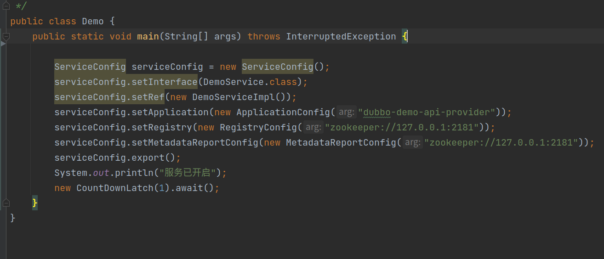
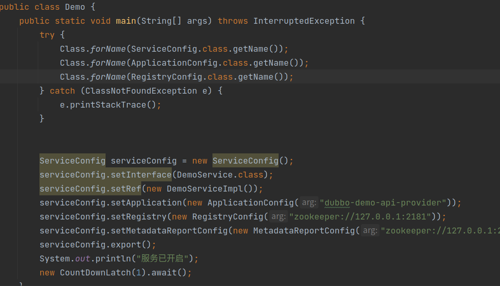

# 1. 开发规划


## 1.1 前期工作

从贴合用户的角度，用反射做了个demo,证明了我们目前的思路确实可行，唯一会有冲突的是javassit的问题不过目前也已经解决掉了。

##  1.2 目前总体思路：

 1.    先用接口实现启动一个服务，解决出现的问题（细节是魔鬼）；

 2.    解决代码生成的问题。这个不会太难，在手写了一些样板代码后，我发现这个其实很好搞的。因为大多数都是很相似的。

       

## 1.3  具体方案阐述

首先要声明的是为减少前期开发复杂度，我会先另起一个项目叫DubboPro进行开发，之后在考虑代码生成的阶段，再将这个项目作为dubbo的一个模块（dubbo-module）进行合并开发。


### 1. 包设计

|-DubboPro

------|- internal.jar

------|-org

----------|-apache

--------------|-dubbo

------------------|- config

-----------------------|- ServiceConfig.class

------------------|- Interface

-----------------------|-ServiceConfigInterface.class

-----------------------|-RegistryConfigInterface.class

由于用户签名不能改变，所以我们暴露给用户的类所在包的报名不能发生改变，就保持原样，比如说上图中的ServiceConfig.class,原本是在org.apache.dubbo.config包下，他就还得在这个包下。

interface的话随便放，为了方便我们就把他统一放在Interface这个包下就行了。

### 2. 对于源码的改动

让需要暴露的类实现一个需要暴露的方法的接口，也就是我们org.apache.dubbo.Interface包下的那些，不过既然是实现已有的那么，相当于实现了一个空接口一样，不需要改变其他部分。

### 3. 类加载器设计

​	  只需要注意一点，org.apache.dubbo 包名开头的一律走自定义类加载器（除了org.apache.dubbo.common.bytecode,和org.apache.dubbo.Interface这两个个包)，其他的没啥，接口设置的友好一些方便以后的使用。

# 2. 目前遇到的问题

目前好的一点是终于可以debug了

现在遇到的问题是，在我用接口重做，并将jdk降为1.8之后，运行这个demo



会出现

```java
loader constraint violation: loader 'app' wants to load class org.apache.dubbo.config.ApplicationConfig. A different class with the same name was previously loaded by org.apache.dubbo.DubboClassLoader$InternalURLClassLoader @5bcab519. (org.apache.dubbo.config.ApplicationConfig is in unnamed module of loader org.apache.dubbo.DubboClassLoader$InternalURLClassLoader @5bcab519, parent loader 'app')
```

的问题，应该是说在低版本的时候，有个约束就是，父类加载器，不能加载子类加载器加载过的同名类。

好吧......

那我们先用提前用父类加载器（app）加载一下就解决了这个问题（因为子类加载器，可以加载父类加载器加载过的同名类。）

如下



之后报错变了，证明我们的猜想是正确的，但是对现有报错进行排查（很痛苦的排查），我发现错误在于

在AbstractConfigManager的static块里边有个这样的操作

```java
        uniqueConfigTypes.add(ApplicationConfig.class);
        uniqueConfigTypes.add(MonitorConfig.class);
        uniqueConfigTypes.add(MetricsConfig.class);
        uniqueConfigTypes.add(SslConfig.class);
```

按理说，ApplicationClass.class的类加载器是加载AbstractConfigManager的加载器，也就是DubboClassLoader但是实际上是appclassLoad加载器，而appclassloa的加载到是我们的伪装类所以这里会出错误


现在有两种解决方案

1.   类加载器那块得降版本
2.   找一下ApplicationConfig.class这个东西应该是有个什么cache之类的，有没有办法取消掉


现在恢复了反射版本，和现有版本进行比较发现了，好像并不是版本引起的错误，现在考虑让矛盾凸显在一个点上，看能不能解决。

反射版本现在也是通过java8构建的，但是就没有那么多约束。

为什么呢？

serviceConfig.setApplicationConfig(ApplicationConfig config);

这个config为什么不会出现问题，这个就没有说有两个相同类不能做转换cast。

```java
loader constraint violation in interface itable initialization for class org.apache.dubbo.config.ServiceConfig: when selecting method 'void org.apache.dubbo.Interface.ServiceConfigInterface.setApplication(org.apache.dubbo.config.ApplicationConfig)' the class loader 'app' for super interface org.apache.dubbo.Interface.ServiceConfigInterface, and the class loader org.apache.dubbo.DubboClassLoader$InternalURLClassLoader @5700d6b1 of the selected method's abstract class, org.apache.dubbo.config.AbstractInterfaceConfig have different Class objects for the type org.apache.dubbo.config.ApplicationConfig used in the signature (org.apache.dubbo.Interface.ServiceConfigInterface is in unnamed module of loader 'app'; org.apache.dubbo.config.AbstractInterfaceConfig is in unnamed module of loader org.apache.dubbo.DubboClassLoader$InternalURLClassLoader @5700d6b1, parent loader 'app')
```

